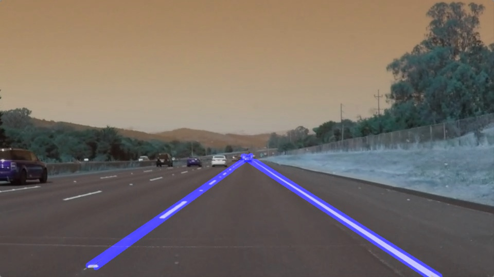
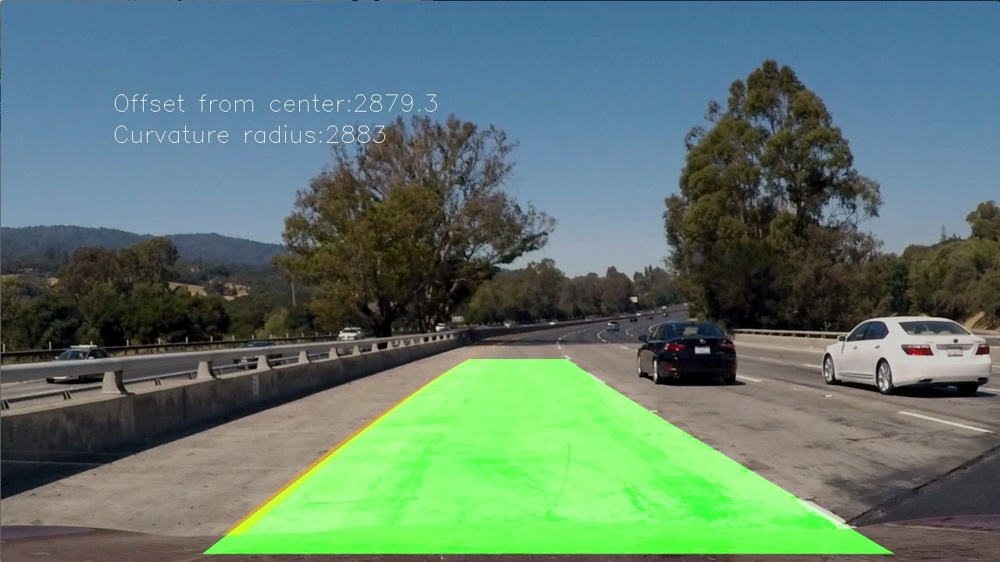
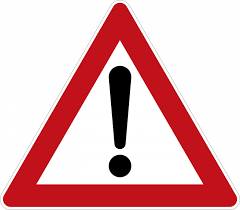
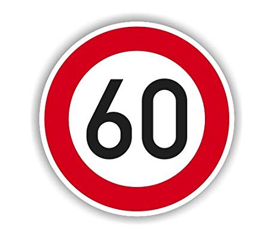
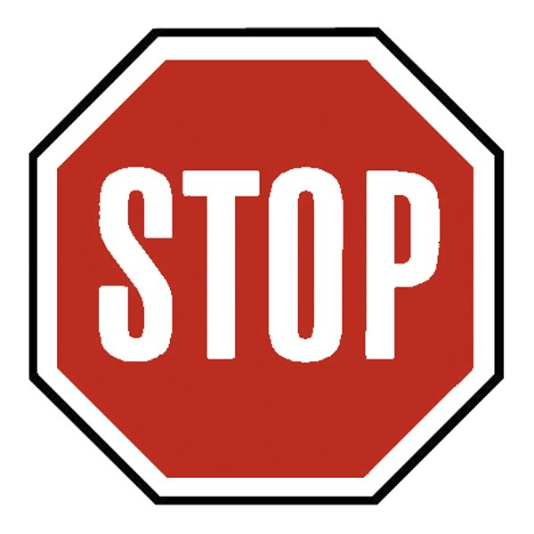
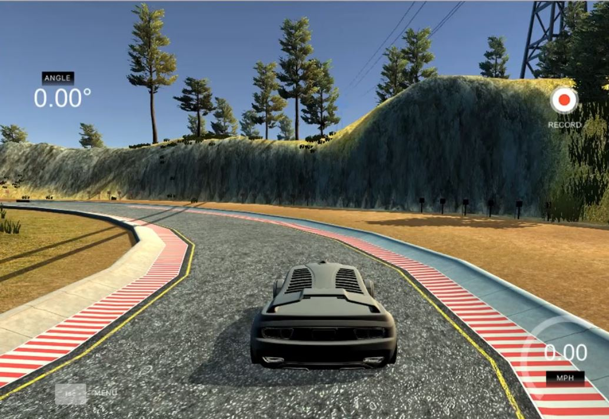
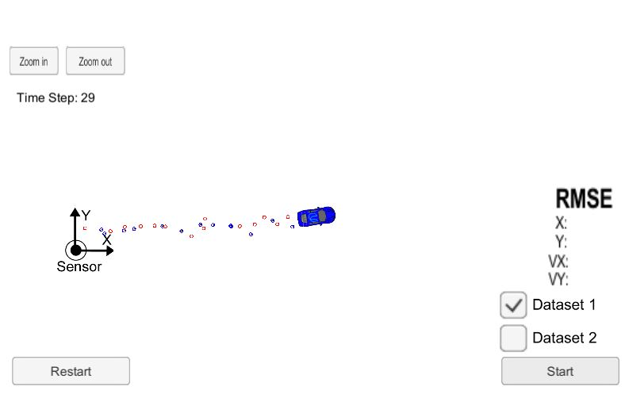

# Self-Driving Car Nanodegree

### Youtube channel: https://www.youtube.com/playlist?list=PLYlklv-A-kFF105TvkSZyx4gmzkFcsoCy

## Table of Contents

#### [1-Detecting Lane Lines](P1-Finding-LaneLines)
 - **Summary:** Detected highway lane lines on a video stream. Used OpencV image analysis techniques to identify lines, including Hough Transforms and Canny edge detection.
 <table>
  <tr>
    <th>
      

           
      

    </th>
 </tr>
   </table>
 
 #### [2-Advanced Lane Finding](P2-Advanced-Lane-Finding)
 - **Summary:** Built an advanced lane-finding algorithm using distortion correction, image rectification, color transforms, and gradient thresholding. Identified lane curvature and vehicle displacement. Overcame environmental challenges such as shadows and pavement changes.
  <table>
  <tr>
    <th>
      

           
      

    </th>
 </tr>
   </table>
 
#### [3-Traffic Sign Classification](P3-Traffic-Sign-Classifier)
 - **Summary:** Built and trained a deep neural network to classify traffic signs, using TensorFlow. Experimented with different network architectures. Performed image pre-processing and validation to guard against overfitting.
 <table>
  <tr>
    <th>
      

        
      

    </th>
     <th>
      

        
      

    </th>
     <th>
      

        
      

    </th>
     <th>
      

        
      

    </th>
     <th>
      

        
      

    </th>
 </tr>
   </table>
   
#### [4-Behavioral Cloning](P4-Behavioral-Cloning)
 - **Summary:** Built and trained a convolutional neural network for end-to-end driving in a simulator, using TensorFlow and Keras. Used optimization techniques such as regularization and dropout to generalize the network for driving on multiple tracks.
 <table>
  <tr>
    <th>
     

      
     

    </th>
 </tr>
   </table>
   
#### [5-Extended Kalman Filter](P5-Extended-Kalman-Filter)
 - **Summary:** Implement the extended Kalman filter in C++. Simulated lidar and radar measurements are used to detect a bicycle that travels around your vehicle. Kalman filter, lidar measurements and radar measurements are used to track the bicycle's position and velocity.
  <table>
  <tr>
    <th>
     

      
     

    </th>
 </tr>
   </table>

#### [6-Kidnapped Vehicle](P6-Kidnapped-Vehicle)
 - **Summary:** Your robot has been kidnapped and transported to a new location! Luckily it has a map of this location, a (noisy) GPS estimate of its initial location, and lots of (noisy) sensor and control data. In this project you will implement a 2 dimensional particle filter in C++. Your particle filter will be given a map and some initial localization information (analogous to what a GPS would provide). At each time step your filter will also get observation and control data.
 <table>
  <tr>
    <th>
      
    </th>
 </tr>
 </table>
 
#### [7-Highway-Driving](P7-Highway-Driving)
- **Summary:** The goal in this project is to build a path planner that is able to create smooth, safe trajectories for the car to follow. The highway track has other vehicles, all going different speeds, but approximately obeying the 50 MPH speed limit. The car transmits its location, along with its sensor fusion data, which estimates the location of all the vehicles on the same side of the road.
 <table>
  <tr>
    <th>
      
    </th>
 </tr>
 </table>

#### [8-PID Control](P8-PID-Controller)
 - **Summary:** Implement a PID controller for keeping the car on track by appropriately adjusting the steering angle.
  <table>
  <tr>
    <th>
      
    </th>
 </tr>
 </table>
 
#### [9-Programming-Real-Self-Driving-Car](P9-Programming-Real-Self-Driving-Car)
- **Summary:** Implement full system to control the car starting from perception untill motion planning and control by making nodes on ROS System and connecting it to Udacity Simulator
   <table>
  <tr>
    <th>
      
    </th>
 </tr>
   </table>
